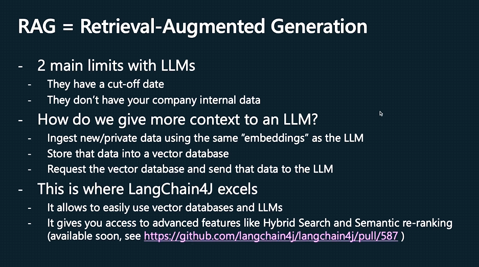

## ia-pocs

 - OpenSource
 - A Java version of the existent Python LangChain
 - Easily integration with many LLMs
### RAG - 
- AI Services - LangChain4j provides an object (proxy) that implements this interface. 
You can think of AI Service as a component of the service layer in your application.
- Formatting inputs for the LLM
- Parsing outputs from the LLM

Cool things to mention
- it supports already some different Embedding stores (Vector Database)
  Cassandra, Chroma, Elasticsearch, Milvus, OpenSearch, Qdrant, Pinecone and many others(20+)

2 levels of abstraction

- low level like ChatLanguageModel
  You have complete control over how to combine them, but you will need to write more glue code.
- high level like Ai Services
  Which hides all the complexity and boilerplate from you. You still have the flexibility to adjust and fine-tune the behavior, but it is done in a declarative manner.

Library structure
- langchain4j-core  		- for low level abstraction
- langchain4j 				- for high level abstraction
- langchain4j-{integration} - for providing integration with various LLM providers and embedding stores

Langchain4j - https://docs.langchain4j.dev/tutorials
About RAG - https://blogs.nvidia.com/blog/what-is-retrieval-augmented-generation/
LangChain4j - use the power of LLMs in java - https://www.youtube.com/watch?v=x8kkjmCZTaw

